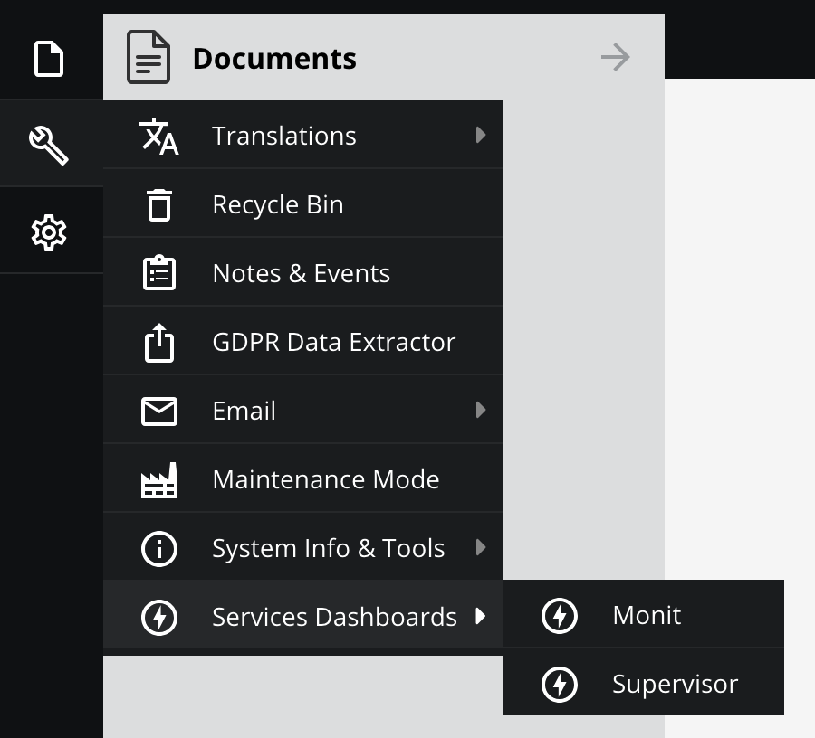

# Pimcore Plugin Admin Toolbar Extension

This plugin allows you to integrate your own menu items into the backend. The target urls can be opened in the iframe panel within the Pimcore admin interface or in a new window.
You can add Items to the main tollbar adn to existing main toolbar items (file, extras, settings) as well. 



## Version information

| Bundle Version | PHP  | Pimcore |
|----------------|------|---------|
| 1.0            | ^8.3 | ^11.0   |

## Installation

```shell
composer require basilicom/pimcore-plugin-admin-toolbar-extension
```

### Activate Plugin

Add to \App\Kernel.php

```php
public function registerBundlesToCollection(BundleCollection $collection)
{
    // ...
    $collection->addBundle(new PimcorePluginAdminToolbarExtensionBundle());
    // ...
}
```

### Build Assets

```shell
bin/console assets:install --symlink --relative
```

### Add config

```yaml
pimcore_plugin_admin_toolbar_extension:
    main_toolbar:
        infos:
            label: Information
            iconCls: 'pimcore_icon_operator_text'
            menu:
                infos_default:
                    label: Default information
                    iconCls: 'pimcore_icon_operator_boolean'
                    url: '/admin/basilicom-toolbar-extension/demo'
                infos_expert:
                    label: Expert information
                    menu:
                        info_item_two_sub:
                            label: Info Item Two Sub
                            url: '/admin/basilicom-toolbar-extension/demo'
        docs:
            label: Search Google
            url: 'https://google.com'
            new_window: true

    extras_menu:
        services:
            label: Services
            menu:
                monit:
                    label: Monit
                    url: '/admin/basilicom-toolbar-extension/demo' #required
                supervisor:
                    label: Supervisor
                    url: '/admin/basilicom-toolbar-extension/demo' #required
        elastic:
            label: Elastig Search
            iconCls: 'pimcore_nav_icon_search'
            url: '/admin/basilicom-toolbar-extension/demo' #required

    settings_menu:
        some_settings_entry:
            label: Settings Entry
            url: '/admin/basilicom-toolbar-extension/demo' #required

    file_menu:
        some_file_entry:
            label: File Entry
            url: '/admin/basilicom-toolbar-extension/demo' #required

```

### Pimcore nav icon css classes

see: https://github.com/pimcore/admin-ui-classic-bundle/blob/2.x/public/css/icons.css